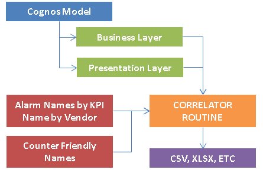

# Introduction

Mapping Business Layer and Presentation Layer with Alarm Information.

# Overview


# How to Use
1. Open the Source Code in Eclipse.
2. Locate the com.psl.cognos.model.crosslaunch.Main class.
3. Configure the [JVM Arguments](#JVM Related).
4. Run the program.

# Source Code

## com.psl.cognos.model.crosslaunch
1. The main class, `Main.java`.

## com.psl.cognos.model.crosslaunch.component
1. Class templates for various object creation.
2. Each class represents some kind of information used in `CORRELATOR ROUTINE`.

## com.psl.cognos.model.crosslaunch.meta
1. Meta information for the input files.
2. E.g. Which column belongs to which.

## com.psl.cognos.model.crosslaunch.model
1. Modeling facilities.
2. E.g. Model information into Java objects.

## com.psl.cognos.model.crosslaunch.parser
1. XML or Excel parser.

## com.psl.cognos.model.crosslaunch.writer
1. Writers for TXT, CSV, XLSX and etc.

# JVM Related

## Mandatory Argument
1. -DcognosModelFile
   - Refers to the Cognos Model file.

2. -DalarmModelFile
   - Excel file that consist of Alarm information that maps each KPI to respective Alarm Names by Vendor.

## Optional Argument
1. -Djava.util.logging.config
   - `logging.properties` file usually for debugging purpose.

## Important Note
1. Paths must all be in full-absolute-paths format.
 
## Sample JVM Argument
```java
-DcognosModelFile=D:\development\_assignment\TNPM-Cognos-CrossLaunch-Definition\resource\model.xml
-DalarmModelFile=D:\development\_assignment\TNPM-Cognos-CrossLaunch-Definition\resource\alarm_threshold.xlsx
-DoutputFolder=D:\development\_assignment\TNPM-Cognos-CrossLaunch-Definition\output\
-Djava.util.logging.config.file=D:\development\_assignment\TNPM-Cognos-CrossLaunch-Definition\resource\logging.properties
```